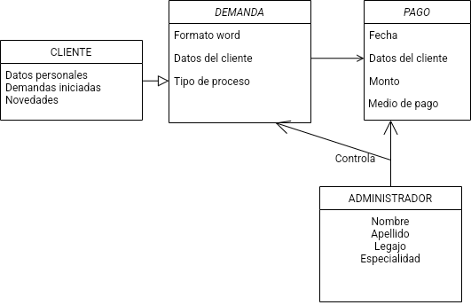

# Abogabot

## Toma de Requerimientos

### 1.  DESCRIPCIÓN GENERAL DEL REQUERIMIENTO

| PROYECTO | PLATAFORMA APLICACION WEB|
|:-----|:-----------|
|Nombre Requerimiento:|ABOGABOT
|   Fecha Solicitud: | 28/09/2022|
|    Responsable| BARRANTES LUIS ALFREDO
   
   
  ### 2.  FASE DE FORMALIZACIÓN

#### Descripción de la Solicitud 

##### Usuario Solicitante:

- Despacho de abogados necesita automatizar las demandas de sus clientes, a través de una página web llenando un formulario.   
- Al momento de llenar el formulario se manda al proceso de pago para finalizar la transacción. 
- Dar seguimiento al cliente de su demanda, el cliente crea una cuenta en la plataforma y verá el seguimiento de cada una de las actualizaciones del proceso legal. 
- Permitir que el/los administrador/es del sitio reciba/n la notificación de una nueva demanda y con los datos del formulario crear automáticamente el documento legal en formato word para empezar el proceso. 
- Recibir los pago y ser capaz de verlo en un dashboard para ver la cantidad de ingresos recibidos. 
- Actualizar el proceso de la demanda y agregar comentarios en cada paso del proceso. 
- Que al usuario le lleguen correos de notificación para saber el avance de su proceso. 
- La página debe de ser responsive para poderla ver desde el celular. 
- La preferencia de colores es azul marino y blanco, pero acepta propuestas. 

|Líder Funcional |
|---|
|Partiendo de lo solicitado por el despacho de abogados se desarrollara una plataforma web que permita la comunicación entre potenciales clientes y el staff de abogados, por medio de la cual los clientes podrán ingresar la solicitud de inicio de demanda, abonar los honorarios pertinentes al proceso y recibiran las novedades de su causa por correo electronico. Los administradores de la plataforma podrán acceder a los datos recibidos del cliente, los pagos y un modelo de demanda para poder trabajar en ella, los administradores tendrán la capacidad de informar a sus clientes el estado del expediente a través de correos electrónicos. Se acepta la preferencia de los colores y se plantearan otros.|

### 3.  ANALISIS DE REQUISITOS Y REQUERIMIENTOS 

|Modelamiento de Negocio|
|---|
|

||Términos de Referencia |
|---|--- |
|**Alcance de la solución**|Se pretende establecer una relación cliente-profesional automatizada, donde el cliente pueda detallar su demanda, realizar el pago, recibir una notificación por cada novedad, ver sus demandas si tiene más de una con el despacho. Los administradores profesionales del despacho recibirán una notificación cada vez que ingrese un nuevo cliente, recibir sus honorarios, tener un escrito jurídico listo para poder trabajar, controlar los pagos recibidos, dar comentarios en los nuevos procesos de cada expediente y comunicarlo directamente al cliente mediante una notificación automática de la plataforma|
|**Requerimientos Funcionales**|Requiere poder recibir el pago de sus honorarios, tener un control de los honorarios, tener un escrito de carácter jurídico en formato word listo para trabajar, comentar las novedades del proceso para que el cliente pueda dar un seguimiento a su demanda, debe ser responsive para poder usarse en escritorio como móvil |
|**Requerimientos no Funcionales y de calidad** |Solicita que se usen los colores azul marino y blanco|

**Interesados en la solución:**

Nombre/Rol/Perfil|Descripción
---|---
DESPACHO DE ABOGADOS|ADMINISTRADOR

| |**Requisitos Técnicos**|
|---|---|
|**Tipo de Desarrollo**|☐ Web          ☐ Escritorio     ☐ Móvil     ☐ Servicio Web|
|**Lenguaje**|☐ JavaScript|
### 4. FASE DE PLANEACIÓN Y GERENCIA DEL PROYECTO

| Plan |estratégico |de fases| de proyecto| |||
|---|---|---|---|---|--------|---|
|**N°**|**Nombre Etapa**|**Actividad**|**Rol Responsable**|**Fecha Inicio**|**Fecha Fin**|**Comentarios**|
|1|Análisis de requisitos|Reunir la información necesaria|Product owner|03/10/2022|07/10/2022|presentación de las necesidades de la aplicación.|
|2|Diseño aplicación|Diseñar Wireframe - ui/ux|Developer|10/10/2022|14/10/2022|Los requerimientos se convierten en un plan y en lo que debería de parecer la aplicación o producto final.|
|3|Desarrollo aplicación |Programar la aplicación|Developer|17/10/22|21/10/22|Se hace la programación de la aplicacion, se programa el código haciendo uso de las mejores prácticas y con las reglas de las guías de desarrollo seguro.|
|4|Verificación|Controlar el funcionamiento|Developer|24/10/22|28/10/22|Controlar y confirmar que las buenas prácticas se aplicaron en el código. Integrando las pruebas de CI/CD e integración de pruebas unitarias.|
|5|Mantenimiento y evaluación|Dar mantenimiento para el correcto funcionamiento|Developer|–|–|La aplicación es un ente vivo y por lo tanto tiene que mantenerse en continuo movimiento. |

>NOTA: Las fechas de planeación establecidas en este documento son aproximadas y estarán sujetas a modificaciones que surjan por control de cambios u otros factores. 

### 5. LEVANTAMIENTO DEL REQUERIMIENTO DETALLADO

||HISTORIAS DE USUARIO|
|---|---|
|Nº.|1|
|Titulo|Formular demanda|
|Fecha|DD/MM/YYYY|
|Estimación|Peso dado por un numero entre 1 y 100 acotado por la serie Fibonacci|

|Característica/Funcionalidad|
|:---:|
|Quiero que el sistema me registre los datos del nuevo cliente en un formulario y a partir del mismo estos datos sean reunidos en un documento de word.|
**Razón/Resultado**|
Con la finalidad de poder editarlo o directamente iniciar el proceso legal|

Criterios de Aceptación||||
---|---|---|---|
Nº|Titulo|Contexto|Evento
1...|Ingreso de cliente nuevo / demanda nueva a la plataforma|En caso de que omita ingresa de algún dato requerido debe generar un mensaje de error.|Cuando el cliente intenta ingresar diligenciando en el formulario incompleto o con datos falaces
2|Registro de pago|Registrar el pago del cliente |A partir del momento en que se efectúa el cierre del proceso de pago correctamente se envía la información del mismo a un dashboard para que los administradores puedan controlar los mismos
n…|

### 6. DISEÑO DE LA ARQUITECTURA DE SOLUCION 

>En caso de que existan excepciones asociadas a la arquitectura de referencia se debe incluir su correspondiente justificación en las vistas que aplique.

Vista Lógica|
---|
Diagrama de Clase|

 

Vista de Implementación
Diagrama de componentes o diagrama de Paquetes

Vista de Proceso
Se puede utilizar alguno de los siguientes diagramas UML: Diagrama de actividades o de flujo 

Si utiliza convenciones para diagramas Ad hoc, por favor describirlas aquí
Vista de Física

Se puede utilizar el diagrama UML de despliegue.

Si utiliza convenciones para diagramas Ad hoc, por favor describirlas aquí
Prototipos de interfaces de usuario

Mockups o Bocetos de interfaces graficas para Front-End.

Si utiliza convenciones para diagramas Ad hoc, por favor describirlas aquí
Firmas de aceptación
Nombre
Dependencia
Teléfono
Firma

Nota: En caso de considerar limitado el uso de UML, es posible utilizar diagramas Ad Hoc.

